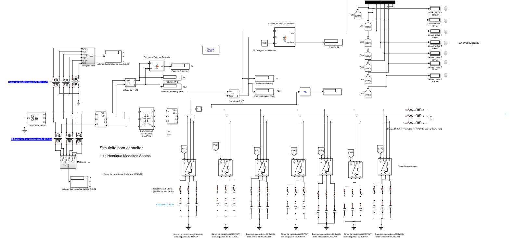
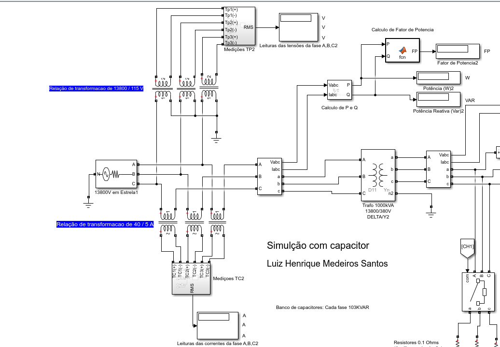
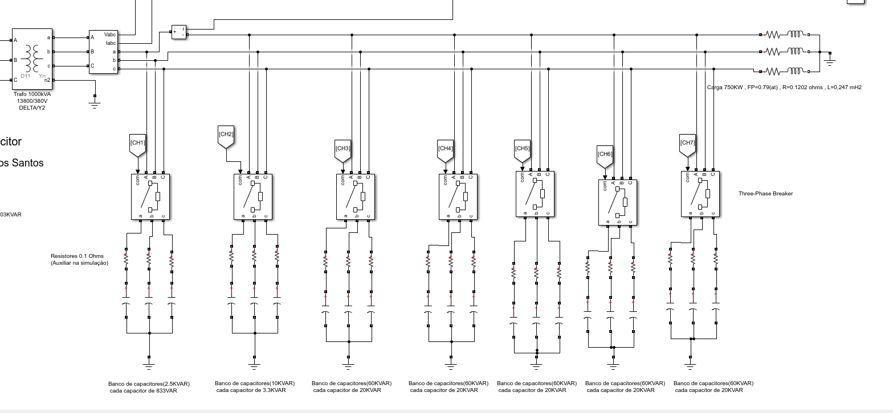
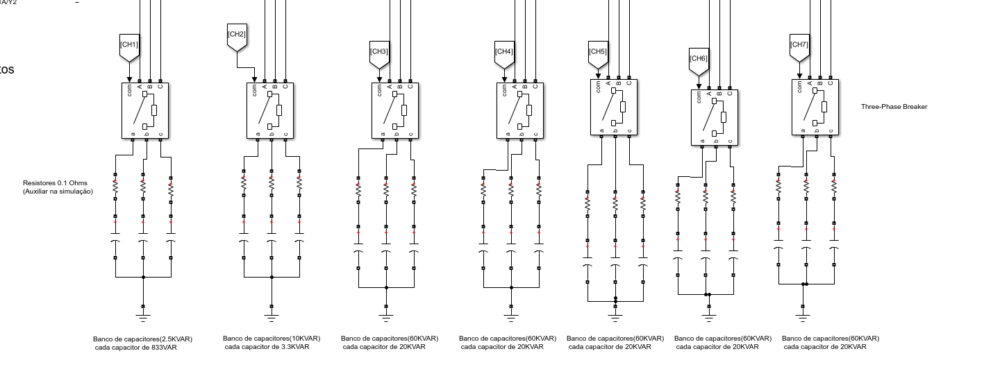
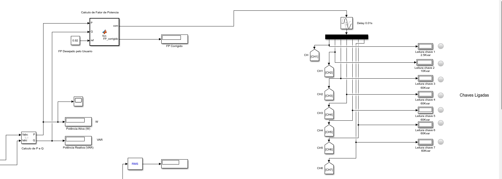

#  Controle Automatico de Banco de Capacitores (Simulink)

Projeto de correção automática de fator de potência utilizando MATLAB/Simulink. Para simular uma correção de FP para 0.94 de uma industria com carga de 750KW e Fator de potência de 0.79 (Atrasado).

Foram utilizados ao todo 312Kvar de potência reativa . 5 Bancos de 60 kVAR , 1 banco de 10kVAR, 1 banco de 2,5kVAR . o FP pode ser corrigido de 0,79 até 0,94 . Na pratica o fator de potencia tem que estar sempre acima de 0,92 .

##  Objetivo
Corrigir o fator de potência de uma carga através da inserção automática de bancos de capacitores.

##  Funcionamento
O modelo mede potência ativa (P) e reativa (Q) e calcula o fator de potência.  
Quando o FP está abaixo do valor desejado, o sistema conecta capacitores para compensação reativa.

Todo o controle é feito pelo bloco Matlab Fuction. Que se baseia na ideia de calcular o reativo que o usuario quer injetar e apartir dessa quantidade o codigo começa a fazer chaveamento ate atingir o fator de potência desejado do usuario. 

Codigo disponivel em : matlab_function/logica_controle_banco/logica_controle.m

## Arquivo principal
- `capacitor_bank.slx`

##  Resultados

### Modelo Simulink e Resultados

##  Como executar
1. Abrir MATLAB
2. Abrir `Banco_Capacitores_Automatico.slx`
3. Rodar a simulação

##  Conceitos aplicados
- Fator de potência
- Potência reativa
- Compensação capacitiva
- Controle automático

##  Autor
Luiz Henrique Medeiros Santos